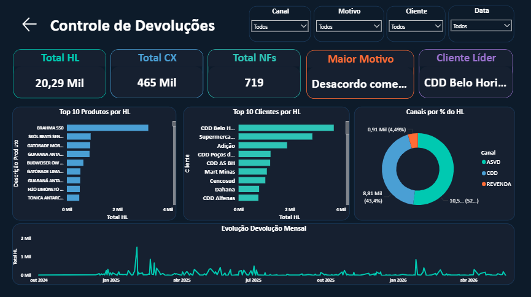
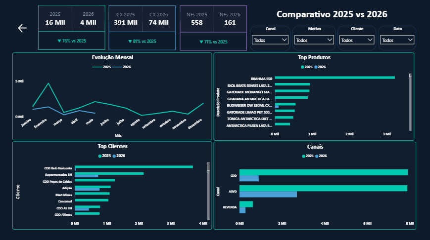

# 📦 Dashboard de Controle de Devoluções — Power BI

> Solução completa de análise e monitoramento de devoluções para o mercado de bebidas, desenvolvida em Power BI com integração ao SharePoint e Excel.

---

## 📊 Visão Geral

Dashboard corporativo desenvolvido para acompanhar e analisar devoluções de produtos, consolidando dados de **2025 e 2026** em uma solução interativa com atualização automática via SharePoint.

### Páginas do relatório

| Página | Descrição |
|--------|-----------|
| **Início** | Tela de navegação com KPIs consolidados e acesso às páginas |
| **Controle de Devoluções** | Visão operacional completa com filtros por canal, motivo, cliente e período |
| **Comparativo 2025 vs 2026** | Análise comparativa entre anos com variação percentual |

---
## 📸 Screenshots

### Página Inicial


### Controle de Devoluções


### Comparativo 2025 vs 2026



--- 

## 🚀 Funcionalidades

- **KPIs em tempo real**: Total HL, Caixas, NFs, Maior Motivo, Cliente Líder
- **Comparativo anual**: variação % entre 2025 e 2026 para HL, CX e NFs
- **Top 10 Produtos e Clientes** por volume de devolução (HL)
- **Evolução mensal** com linha dupla 2025 vs 2026
- **Análise por canal**: ASVD, CDD e Revenda
- **Slicers interativos**: Canal, Motivo, Cliente e Data
- **Navegação entre páginas** com botões customizados


---

## 🛠️ Tecnologias utilizadas

- **Power BI Desktop** — modelagem, visuais e publicação
- **DAX** — medidas calculadas, comparativos e formatação condicional
- **Power Query (M)** — tratamento e transformação de dados
- **Excel / SharePoint** — fonte de dados 
- **Office Scripts (TypeScript)** — extração de dados para automação

---

## 📐 Arquitetura de dados

```
Excel (SharePoint)
    ├── Sheet1          → dados de devoluções 2026
    ├── Sheet1_2025     → dados de devoluções 2025
    ├── base_organizada → mapeamento ECC → S4 (2026)
    ├── base_organizada_2025 → mapeamento ECC → S4 (2025)
    ├── HL              → fator de conversão por produto
    └── Canal           → classificação de clientes por canal

Power Query
    ├── Sheet1_Consolidado → Append de 2025 + 2026 com coluna Ano
    

Medidas DAX
    ├── HL Devolvido Total  → SUMX com LOOKUPVALUE para conversão HL
    ├── HL 2025 / HL 2026   → CALCULATE com filtro por Ano
    ├── Var % HL/CX/NFs     → DIVIDE com variação percentual
    ├── HL Periodo Selecionado → DATESINPERIOD dinâmico
    └── Textos de variação  → FORMAT com seta direcional automática
```

---

## 🎨 Design

Tema escuro personalizado com paleta corporativa:

| Elemento | Cor |
|----------|-----|
| Fundo da página | `#0D1B2A` |
| Fundo dos cards | `#111E2E` |
| Total HL | `#00C9B1` |
| Total CX | `#4A9FD4` |
| Total NFs | `#9B72CF` |
| Motivos | `#FF6B35` |
| Texto principal | `#E8EDF5` |

---

## 📁 Estrutura do repositório

```
📂 dashboard-devolucoes-powerbi/
├── 📄 README.md
├── 📊 Controle_de_Devoluções.pbix     ← arquivo Power BI
├── 📂 assets/
│   ├── screenshot_inicio.png
│   ├── screenshot_controle.png
│   └── screenshot_comparativo.png
└── 📂 docs/
    └── guia_atualizacao.md
```

---

## ⚙️ Como usar

### Pré-requisitos
- Power BI Desktop instalado
- Acesso ao SharePoint com o arquivo Excel fonte

### Configuração
1. Clone o repositório
2. Abra o arquivo `Controle_de_Devoluções.pbix` no Power BI Desktop
3. Em **Transformar dados → Configurações da fonte**, atualize o caminho do Excel para o seu SharePoint
4. Clique em **Atualizar** para carregar os dados
5. Publique no Power BI Service no seu workspace

---

## 📈 Principais métricas

| Métrica | 2025 | 2026 (jan–mai) |
|---------|------|----------------|
| HL Devolvido | 17,84 Mil | 2,45 Mil |
| Caixas | 421 Mil | 44 Mil |
| Notas Fiscais | 558 | 161 |
| Principal motivo | Desacordo comercial | Desacordo comercial |

---

## 👨‍💻 Autor

**Gustavo Henrique Silva Nascimento**  

---

*Desenvolvido como ferramenta interna de controle e análise de devoluções.*
